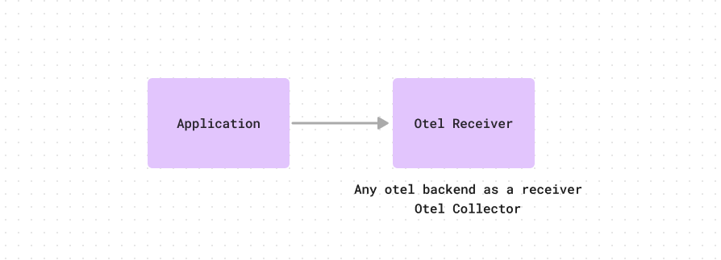
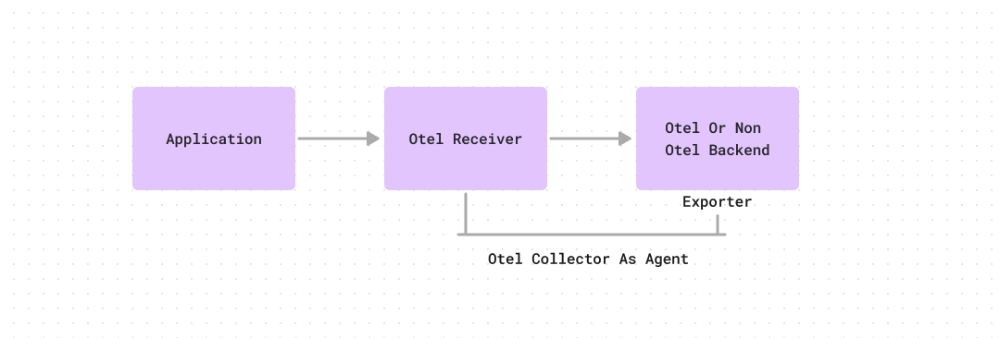
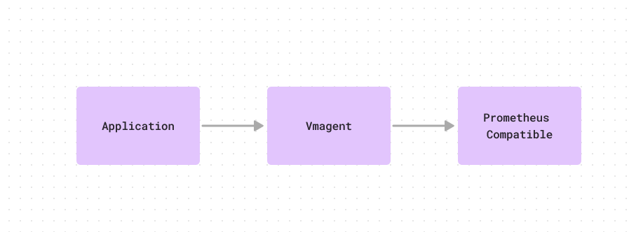
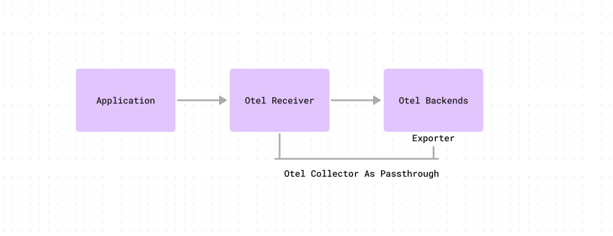
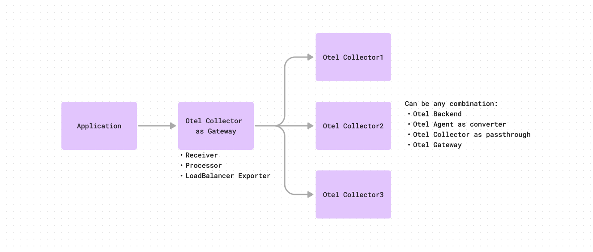

### go-otel-cookbooks

This repo describes recipes for pushing instrumented code metrics via OTel to a backend.
The aim of this repo is to showcase the flexibility of OTel metric ingestion pipeline
and educate the user on various approaches so that they can take an informed decision on
which approach to follow for their specific use case.

### Pre-requisite environment variables set

  ```
  export ENDPOINT_DOMAIN='http://otel-agent:4317'
  export REMOTE_WRITE_URL='http://victoriametrics:8429/api/v1/write'
  ```

### Push using direct remotewrite - OTel backend

- Metric ingestion flow

  

- Use when you want to:

  - Push directly to an OTel supported backend. Here backend means the storage system that you are going to query e.g. Prometheus.

- Do not use when:

  - Your backend does not support native OTel based ingestion.

- Pros:

  - Simple setup - no intermediate agents e.g. vmagent, prometheus-agent are required.

- Cons:

  - Lack of intermediate agent implies that the application has to fulfill the role of ensuring - retrying
    if backend not available, buffering data up to a certain point, etc.

  - The application upfront declares that it is tightly coupled with OTel based ingestion mechanisms. If we need
    to move this away from pure OTel based setup to an intermediate agent based flow e.g. vmagent, it will need
    code refactoring.

- Try it out

  ```
  cd push-using-direct-remotewrite/direct-backend

  # Read main.go for understanding the instrumentation done

  docker-compose up
  ```

  This setup currently pushes to a vmagent based backend, because the test setup doesn't have an OTel backend to write to.

### Push using direct remotewrite - via collector

- Metric ingestion flow

  

- Use when you want to:

  - Push to a backend that supports integration with an agent (e.g. vmagent), but may not necessarily
    be speaking the OTel protocol.

- Do not use when:
  - Your setup does not have an existing agent the OTel collector can write to.

- Pros:
  - Has an advantage over the previous flow - the application can delegate parts of the resiliency logic to the
    collector.
  - User can do intermediate processing via the `processor` section.
  - When moving away from an existing agent based setup to a pure OTel setup, this flow can leverage your existing agent setup
    to remove the scrape functionality but still keep the remote write functionality.

- Cons:
  - Requires maintaining both OTel and vmagent setups.
  - Can only support single endpoint for ingestion => scenarios like agent clustering cannot be leveraged.

- Try it out

  ```
  cd push-using-direct-remotewrite/via-collector

  docker-compose up
  ```

### Push using agent - vmagent

- Metric ingestion flow

  

- This sample setup shows integrating one of the popular metric ingestion agents e.g. vmagent which supports OTel based ingestion.

- Use when you want to:
  - Instrument your code using OTel but do want to deploy OTel based metric ingestion stack.

- Do not use when:
  - You are already having an OTel based ingestion stack.

- How is this different from pushing via direct remote write collector scenario described above?
  - In the collector based approach the flow was - application -> otel receiver -> otel backend (vmagent) -> storage (Levitate, Prometheus, etc.)
  - In this approach, there is no OTel config required as per the metric ingestion flow described above.

- Pros:
  - As long as the agent supports OTel based ingestion, the application can write to it with instrumented OTel code.

- Cons:
  - Dependency on an agent outside of the OTel ecosystem.

- Try it out

  ```
  cd push-using-agent/vmagent

  docker-compose up
  ```

### Push using agent - otel agent

- Metric ingestion flow

  

- Use when you want to:
  - Use OTel native exporter agent and do not want to maintain another agent config.

- Do not use when:
  - You have another agent in place and do not want to phase it out.

- Pros:
  - No need to maintain another agent - directly use the OTel agent based flow by leveraging the `exporter` section.

- Cons:
  - Similar to the earlier approaches, where if you move away from an existing known agent e.g. vmagent, you have to relearn the failure modes
    of the new agent and account for that knowledge during debugging scenarios via metrics and logs.

- Try it out

  ```
  cd push-using-agent/otel-agent

  docker-compose up
  ```

### Push using agent - gateway

- Metric ingestion flow

  

- Use when you want to:
  - Load balance ingestion layer to horizontally scale collectors.

- Do not use when:
  - Your scale isn't high enough to justify load balancing collectors.

- Pros:
  - Lays the foundation for future scalability.

- Cons:
  - Requires understanding OTel config for load balancing well enough to achieve the right behaviour.

- Try it out

  ```
  cd push-using-agent/otel-gateway

  docker-compose up
  ```
